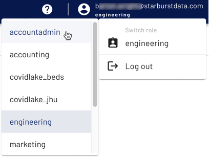

<!-- MORE SUBMODULES CAN BE ADDED TO DIVIDE UP THE SETUP INTO SMALLER SECTIONS -->
<!-- COPY AND PASTE THIS SUBMODULE FILE, RENAME, AND CHANGE THE CONTENTS AS NECESSARY -->

## Login to Starburst Galaxy <!-- MODIFY THIS HEADING -->

1.  Navigate to the [Starburst Galaxy login page](https://galaxy.starburst.io/login).
2.  If you don’t have an account, [create a new one](https://docs.starburst.io/starburst-galaxy/get-started.html) and verify the account with your email.
3.  Switch to an account admin level role. If this is the first time you have logged in, or you have never made any additional roles, you are automatically assigned to the accountadmin role.

