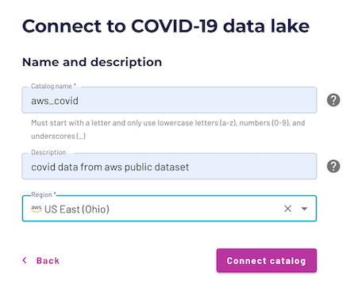
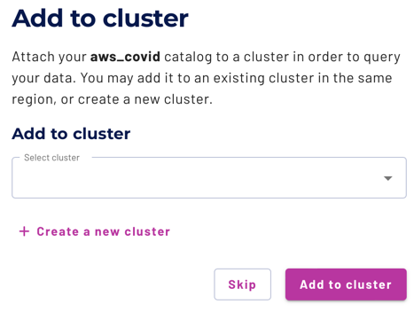

## Connect Starburst Galaxy to AWS

### Create a catalog in Starburst Galaxy

Catalogs contain the configuration and connection information needed to access a data source. To gain this access, configure a catalog and use it in a cluster.

This tutorial utilizes the public COVID-19 data lake that lives on AWS, which simplifies the setup process significantly. Instead of creating an S3 catalog, where you are required to have access to an AWS account, the data for this tutorial is accessible without charge and without AWS credentials by connecting to the AWS [COVID-19 data lake](https://docs.starburst.io/starburst-galaxy/catalogs/covid-19.html) dataset catalog.

1.  In the navigation menu, click **Catalogs**, then **Create Catalog**.
2.  Scroll down to **Select a dataset**.
    *   Select **AWS COVID-19 data lake**.
    *   Enter a relevant catalog name such as `aws_covid`.
    *   Add a relevant description such as `COVID data from AWS public dataset`.
    *   Add the `US East (Ohio) region` to the catalog as this is the only region where the dataset lives.
    *   Select **Connect catalog**.

Select **Save access controls** on the **Set permissions** page to add the default access controls.

### Create a cluster in Starburst Galaxy

A Starburst Galaxy cluster provides the resources necessary to run queries against your catalogs. Use the Starburst Galaxy **Cluster explorer** to access the catalog data exposed by running clusters.

1.  On the Add to cluster page, select **\+ Create a new cluster**.

*   Enter cluster name: `aws-covid-cluster`.
*   Cluster size: _Free_.
*   Cluster type: _Standard_.
*   Catalogs: `aws_covid`, `tpch`.
*   Cloud provider region: _US East (Ohio)_, also known as _us-east-2_.
    1.  Select **Create cluster**.
    2.  Select **Add to cluster**.
    3.  Select **Query my data**.

Confirm that you have connected your cluster to both the `aws_covid` and `tpch` catalogs by exploring the `aws-covid-cluster` in the **Cluster explorer**. If you do not have both catalogs, navigate to the **Clusters** page and edit your cluster.

After configuring the catalog and cluster, you are directed to the query editor to continue the tutorial. Notice that the location drop-downs in the top right corner have already selected the proper cluster and catalog for querying.

