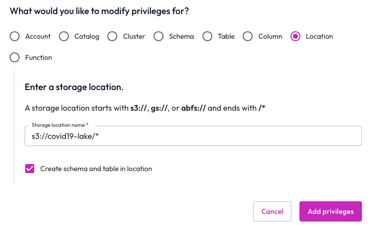

Configure role-based access control
-----------------------------------

The Starburst Galaxy access control system uses roles to provide users with privileges for clusters, catalogs, schemas, tables and other types of entities, such as object storage locations.

Configure the accountadmin role to access the COVID-19 data lake location. (But if you have already gone through these steps at the direction of a different Starburst Galaxy tutorial, there is no need to repeat them.)

1.  In the navigation menu, select **Roles and privileges**.
2.  Click on the `accountadmin` role name.
3.  Select the **Privileges** tab.
4.  Select **Add privilege**.
5.  Add privilege to accountadmin role.
    *   Choose **location** as the modify privileges destination.
    *   Add the storage location: `s3://covid19-lake/*`.
    *   Select **Create SQL**.
    *   Select **Add privilege**.

You now have access to all the data sources available in the COVID-19 data lake.