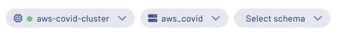

## Create the enigma_jhu table

Navigate to the **Query editor**. Validate the location drop-downs in the top right hand corner match the cluster and catalog previously created.

Create a schema to hold the COVID-19 table.

    CREATE SCHEMA query_federation;
    

In the top right corner, select the `query_federation` schema so that you can easily run the tutorial queries.

The enigma\_jhu dataset provides the _Global Coronavirus Data_ and is sourced from John Hopkins and provided by Enigma. This data tracks confirmed COVID-19 cases in provinces, states, and countries across the world, while also providing a county level breakdown in the United States.

Edit your saved query to match the following SQL command to create the table.

    CREATE TABLE enigma_jhu (
       fips VARCHAR,
       admin2 VARCHAR,
       province_state VARCHAR,
       country_region VARCHAR,
       last_update VARCHAR,
       latitude DOUBLE,
       longitude DOUBLE,
       confirmed INTEGER,
       deaths INTEGER,
       recovered INTEGER,
       active INTEGER,
       combined_key VARCHAR
    )
    WITH (
       format = 'json',
       EXTERNAL_LOCATION = 's3://covid19-lake/enigma-jhu/json/')
    ;
    

Run a select all command to view your results. You can also use the table’s vertical ellipsis menu to generate the command for you in the query editor.

    SELECT * FROM enigma_jhu LIMIT 10;
    

Take notice that the `admin2` column is actually the county. However, it has been improperly named. You can also see that the case information is an aggregate value of each previously updated timestamp. We account for this as you query.